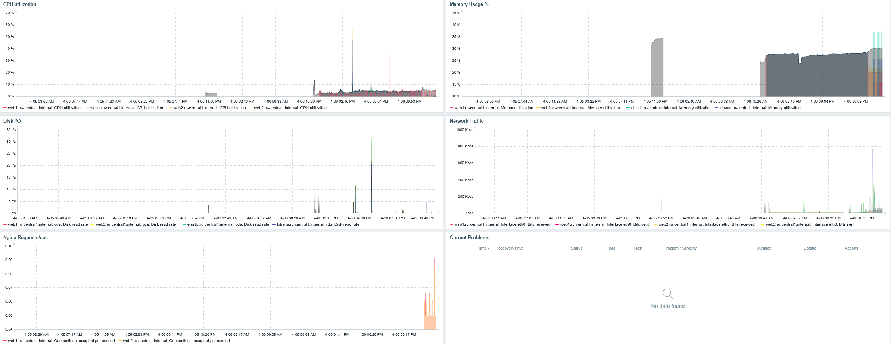
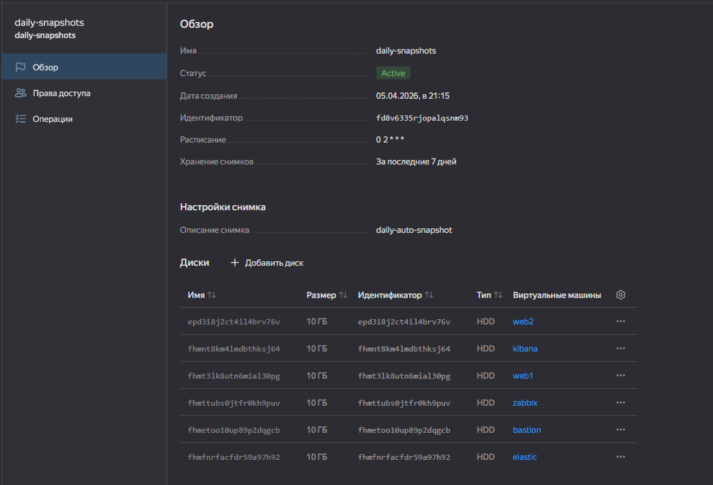
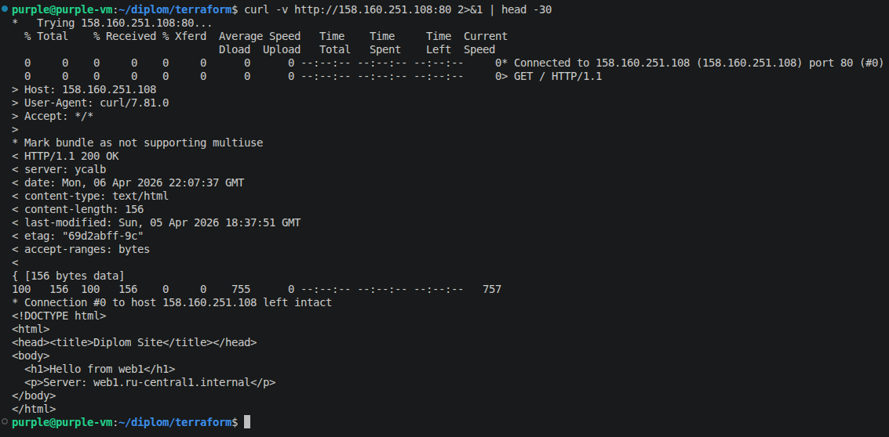
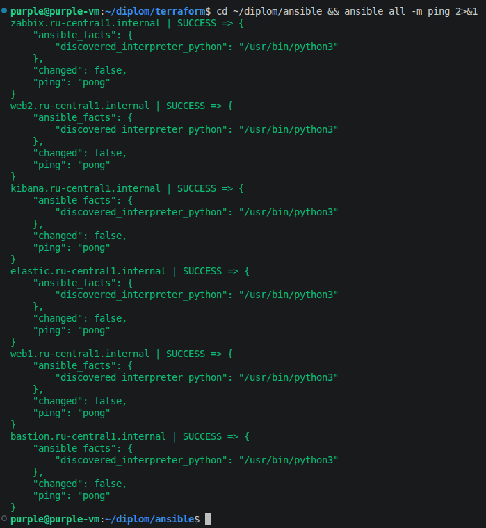
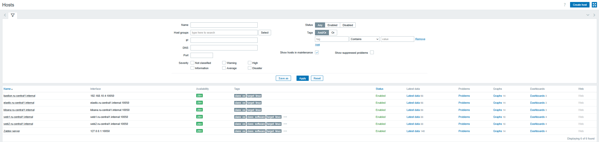
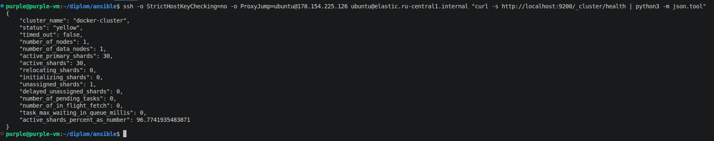
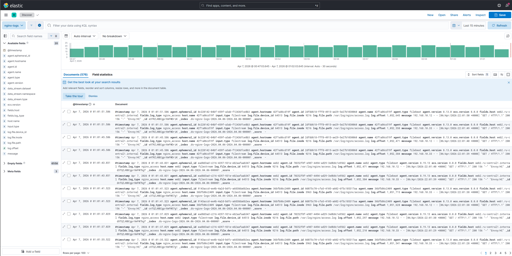

# Дипломная работа по профессии «Системный администратор»

## Задача
Разработать отказоустойчивую инфраструктуру для сайта, включающую мониторинг, сбор логов и резервное копирование. Инфраструктура размещается в Yandex Cloud.

## Используемые технологии
- **IaC**: Terraform v1.14.8
- **Configuration Management**: Ansible 2.12
- **Веб-сервер**: Nginx
- **Мониторинг**: Zabbix 7.0
- **Логи**: Elasticsearch 8.13 + Filebeat 8.13 + Kibana 8.13 (Docker)
- **Балансировка**: Yandex Application Load Balancer

## Доступ к ресурсам

> IP адреса динамические. Актуальные значения: `cd terraform && terraform output`

| Сервис | Как получить актуальный URL |
|--------|----------------------------|
| Сайт (через ALB) | `terraform output alb_public_ip` → порт 80 |
| Zabbix | `terraform output zabbix_public_ip` → порт 80 |
| Kibana | `terraform output kibana_public_ip` → порт 5601 |

## Архитектура сети

| Подсеть | Назначение | Зона |
|---------|-----------|------|
| 192.168.10.0/24 | Публичная: bastion, zabbix, kibana | ru-central1-a |
| 192.168.20.0/24 | Приватная: web1, elastic | ru-central1-a |
| 192.168.30.0/24 | Приватная: web2 | ru-central1-b |

## Решения и компромиссы

### Почему Docker для Elasticsearch и Kibana
Официальный репозиторий Elastic заблокирован в РФ (403 Forbidden).
Решение - использовать Docker образы, что разрешено заданием:
"В случае недоступности ресурсов Elastic рекомендуется разворачивать сервисы с помощью docker контейнеров".

### Почему FQDN в Ansible inventory
Задание явно запрещает использовать IP в inventory.
FQDN вида `web1.ru-central1.internal` резолвится внутри сети Yandex Cloud автоматически.
Bastion находится в той же сети и видит все ВМ по FQDN.

### Почему прерываемые ВМ переведены в постоянные
Задание требует: "перед сдачей работы сделайте ВМ постоянно работающими".
В процессе разработки использовались прерываемые ВМ для экономии ресурсов.

### Почему Elasticsearch в приватной сети
Задание явно указывает: "Сервера web, Elasticsearch поместите в приватные подсети".
Доступ к Elasticsearch только из внутренней сети (порт 9200 открыт только для 192.168.0.0/16).

### Динамические IP и inventory
Публичные IP ВМ динамические (меняются при перезапуске).
IP bastion для ProxyJump обновляется скриптом `update_inventory.sh`:
```bash
~/diplom/update_inventory.sh
```
Актуальные IP всегда доступны через:
```bash
cd terraform && terraform output
```

## Структура репозитория

Папка `terraform/` - вся инфраструктура в коде: сеть, ВМ, балансер, снапшоты, группы безопасности.

Папка `ansible/` - playbook-и для настройки каждого сервиса: nginx, zabbix (сервер + агенты), elasticsearch, kibana, filebeat.

Скрипт `update_inventory.sh` - обновляет IP bastion в inventory после перезапуска ВМ.

## Безопасность
- Токен облака не хранится в git - используется service account key file (`key.json` в .gitignore)
- SSH доступ к приватным VM только через bastion host (ProxyJump)
- Security Groups: каждый сервис открывает только нужные порты
- Приватные VM (web1, web2, elastic) без внешнего IP
- Выход в интернет из приватных ВМ через NAT-шлюз


## Подтверждение работы ресурсов
## Мониторинг
Zabbix 7.0 с агентами на всех ВМ.
Дашборд "Diplom USE Monitoring" включает:
- CPU Utilization (все хосты)
- Memory Usage (все хосты)
- Disk I/O (все хосты)
- Network Traffic (все хосты)
- Nginx Requests (web1, web2)
- Thresholds: CPU >90%, Memory >90%, Disk >85%


## Резервное копирование
- Ежедневные снапшоты всех 6 дисков в 05:00 (расписание: `0 2 * * *`)
- Хранение 7 дней
- Охватывает: bastion, web1, web2, zabbix, elastic, kibana


### Сайт работает через балансер


### Все хосты Ansible доступны



### Elasticsearch работает


## Логи
Filebeat на web1 и web2 отправляет nginx access.log и error.log в Elasticsearch.
Kibana подключена к Elasticsearch для визуализации логов.
Индекс: `nginx-logs-YYYY.MM.DD`


